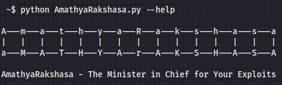

# AmathyaRakshasa - The Minister in Chief for Your Exploits {भवतः शोषणस्य प्रधानमन्त्री} ()



## Introduction

AmathyaRakshasa is not merely an advanced exploit search tool; it mirrors the strategic depth, discernment, and efficiency of its namesake, the legendary minister in ancient Indian statecraft. Crafted to navigate the complex realms of cybersecurity, this tool empowers users to swiftly uncover and aggregate crucial exploit information from both vast online sources and detailed local repositories.

Emulating the unparalleled strategic acumen of Amathya Rakshasa in securing his kingdom, this tool serves as a stronghold for cybersecurity professionals and researchers. It encourages a proactive stance in identifying potential vulnerabilities and associated exploits, echoing Rakshasa's foresight in preempting threats.

At its core, AmathyaRakshasa excels in sifting through the digital expanse, much like Rakshasa's diplomatic ventures, to procure valuable insights into potential security risks. This capability is instrumental in bolstering system defenses against cyber threats while broadening the strategic perspective on cybersecurity challenges.

In essence, AmathyaRakshasa transcends being a mere tool; it stands as a tribute to the intellectual might and strategic ingenuity of Amathya Rakshasa, reimagined for today's digital frontier to safeguard cyberspace realms.

## AmathyaRakshasa Resources

- [Exploit-DB](https://www.exploit-db.com/)
- [Packetstorm Security](https://packetstormsecurity.com/)
- [Exploit Alert](https://www.exploitalert.com/)
- [NVD Database](https://nvd.nist.gov/)
- [Metasploit Modules](https://github.com/rapid7/metasploit-framework/tree/master/modules)

## Installation

```bash
pip install -r requirements.txt

```
 ~$ python AmathyaRakshasa.py --help

A---m---a---t---h---y---a---R---a---k---s---h---a---s---a
|   |   |   |   |   |   |   |   |   |   |   |   |   |   |
a---M---A---T---H---Y---A---r---A---K---S---H---A---S---A

AmathyaRakshasa - The Minister in Chief for Your Exploits

For more information, visit my GitHub repository: [AmathyaRakshasa's GitHub](https://github.com/anantchakravarthy/AmathyaRakshasa)

usage: AmathyaRakshasa.py [options]

Options:
-h, --help                 Show this help message and exit.
-k KEYWORD, --keyword KEYWORD         Specify the search keyword for exploits.
-kv KEYWORD_VERSION, --keyword_version KEYWORD_VERSION Specify the version of the keyword to refine the search.
-nm NMAP, --nmap NMAP      Use Nmap output file for identifying services and versions.
--nvd                      Include NVD as a source of information.
--packetstorm              Include PacketStorm as a source of information.
--exploitdb                Include ExploitDB as a source of information.
--exploitalert             Include ExploitAlert as a source of information.
--msfmodule                Include Metasploit modules as a source of information.
-o OUTPUT, --output OUTPUT Path to save the output.
-ot OUTPUT_TYPE, --output_type OUTPUT_TYPE Choose the output file type: JSON or HTML.

```

### Example

  

*From keyword*

```

python AmathyaRakshasa -k telerik --exploitdb --msfmodule

```

  

*From nmap output*

```

nmap -sV localhost -oX nmap_out.xml
python AmathyaRakshasa.py -nm nnmap_out.xml --packetstorm

```

## To-do
- [ ] Input from nmap result from pipeline
- [ ] Nmap multiple host support


## Contribution

I understand that achieving flawlessness in programming is a challenging endeavor. Should you encounter any issues or bugs, I encourage you to make contributions by rectifying the code or proposing enhancements. Your feedback and suggestions are highly appreciated and play a crucial role.
